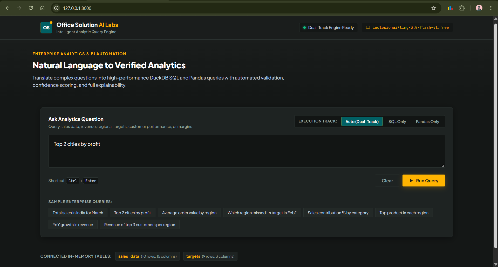

# Intelligent Analytic Query Engine (IAQE)

[](tests/)
[](https://www.python.org/)
[](https://duckdb.org/)
[](server.py)
[](LICENSE)

An enterprise-grade analytical system that translates natural language business questions into verified, executable analytical logic (**DuckDB SQL** primary with **Pandas** fallback). It delivers results accompanied by a **5-signal confidence score**, **3-part plain-English business explanations**, and a **reinforcing few-shot feedback loop**.

Built for **Office Solution AI Labs**.

---

## Key Capabilities

- **Two-Track Execution**: Attempts ultra-fast, in-process DuckDB SQL first; automatically falls back to a secured Pandas DataFrame sandbox if SQL fails.
- **Epistemic Humility & Confidence Scoring**: Computes a composite reliability score (0.0 to 1.0) weighted across Schema Match (25%), Code Validity (20%), Execution Success (25%), Result Validation (20%), and Model Self-Confidence (10%).
- **Deterministic Validation**: Executes 5 post-execution sanity checks on output shapes, non-emptiness, top-N limits, and percentage aggregations before returning data to the user.
- **3-Part Plain-English Explanations**: Generates structured business explanations (*What Was Understood*, *Analytical Approach*, *Assumptions & Limitations*) for non-technical stakeholders.
- **Self-Improving Feedback Loop**: Indexes past verified queries using TF-IDF cosine similarity to dynamically inject positive few-shot patterns and negative guardrails into future prompts.
- **Dual Interfaces**: Operable via an interactive Typer/Rich **CLI** and a responsive **Web Dashboard** styled after `innovationalofficesolution.com`.

---

## Architecture Overview

```
User Query ──▶ [1. Preprocessor] ──▶ [2. Schema Context] ──▶ [3. Intent Classifier (LLM)]
                                                                    │
┌───────────────────────────────────────────────────────────────────┘
▼
[4. Feedback Retrieval] ──▶ [5. Code Generator (LLM)] ──▶ [6. Safe Executor (DuckDB / Pandas)]
                                                                    │
┌───────────────────────────────────────────────────────────────────┘
▼
[7. Result Validator] ──▶ [8. Confidence Scorer] ──▶ [9. Explainer (LLM)] ──▶ [10. Telemetry & Log]
```

---


## Demo Video

[](./asset/IAQE_Demo.mp4)

*Click the preview card above to [watch the full application demo video (MP4)](./asset/IAQE_Demo.mp4).*


https://github.com/user-attachments/assets/4b8ab932-ef6a-4c58-a94e-9056c99a66c8


## Quickstart

### 1. Installation
```bash
git clone <your-repo-url>
cd "Office Solutions AI Lab - Assignment"

python -m venv .venv
# On Windows:
.venv\Scripts\activate
# On Linux/macOS:
source .venv/bin/activate

pip install -r requirements.txt
```

### 2. Configure API Key
Copy `.env.example` to `.env` and set your key:
```bash
cp .env.example .env
```
Edit `.env`:
```ini
OPEN_ROUTER_KEY=your_openrouter_api_key_here
```

### 3. Run the CLI
```bash
# Execute single query
python cli.py query "Total sales in India for March"

# Batch run sample queries
python cli.py batch dataset/nl_queries.json --output outputs/results.json

# View confidence distribution stats
python cli.py stats outputs/results.json
```

### 4. Run the Web Dashboard
```bash
python server.py
```
Open your browser at **[http://127.0.0.1:8000/](http://127.0.0.1:8000/)**.

### 5. Run Automated Tests
```bash
# Run 96 unit tests (offline, pure Python)
python -m pytest tests/unit/ -v

# Run 10 live LLM integration tests
python -m pytest tests/integration/ -v
```

---

## Detailed Documentation

| Document | Purpose |
|---|---|
| [**`SYSTEM_DESIGN.md`**](SYSTEM_DESIGN.md) | Full architectural blueprint, mathematical models, prompt strategies, and trade-offs |
| [**`USER_GUIDE.md`**](USER_GUIDE.md) | Comprehensive operator instructions, CLI options, dashboard walkthrough, and extension guide |
| [**`CODEBASE_ANALYSIS.md`**](CODEBASE_ANALYSIS.md) | Deep technical analysis of every file, class, function, and dataclass in the repository |

